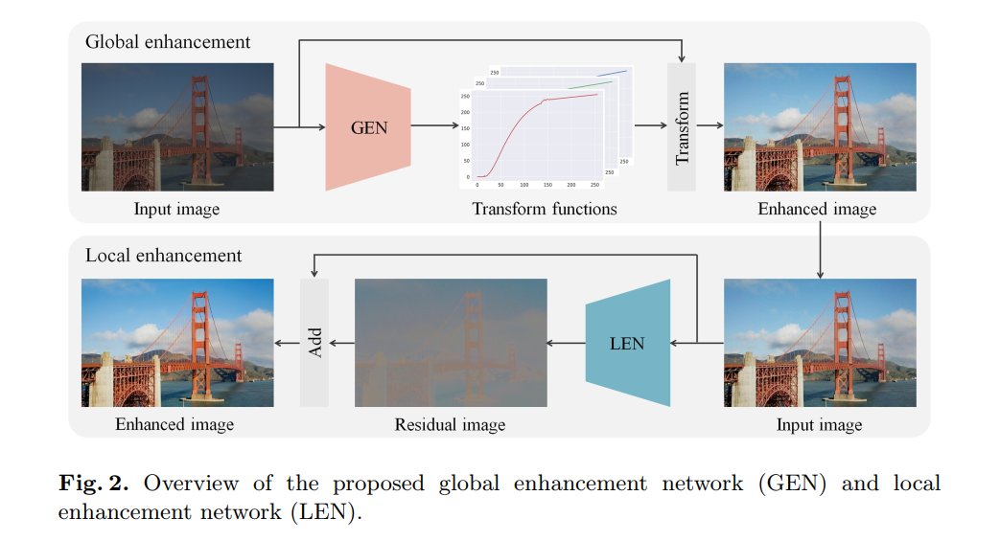

# GEN
this is my pytorch  reproducement about 'Global and Local Enhancement Networks for Paired and Unpaired Image Enhancement'

I only reproduce the GEN, cause LEN is just a Unet, GEN and LEN is seperately.

For five datasets, I use png format and fixed 512 long edge.

Below is my reproducement:

| method    | psnr  | ssim  |
| --------- | ----- | ----- |
| GEN(mine) | 24.40 | 0.913 |
| GEN       | 25.47 | 0.887 |

